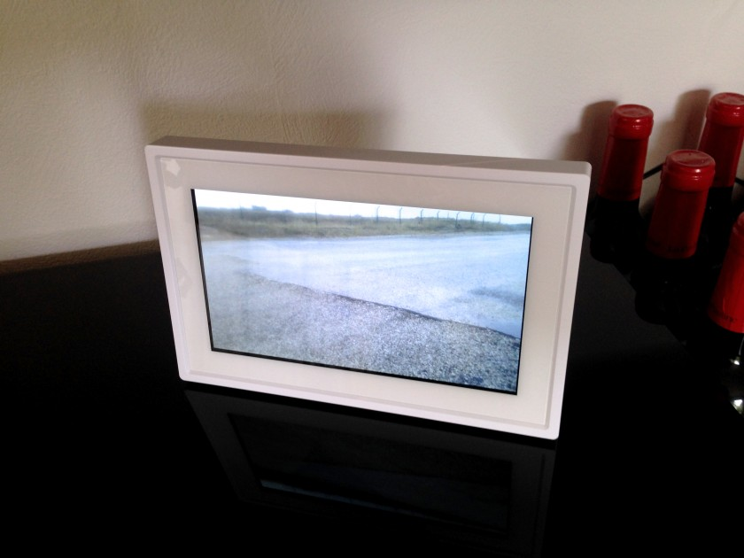

July, 2016  
Originally published on [infi.nl](https://infi.nl/nieuws/macos-keyboard-remappen-met-hammerspoon/) (Dutch)

---
Digitale fotolijstjes, je kent ze wel. Je zet er een keer foto’s op en je hebt in een leuke hoek van je huiskamer elke keer een andere foto. Totdat je ze zat bent.

Je kan er dan natuurlijk weer nieuwe op zetten, maar dat doe je twee of drie keer en dan vergeet je het. Voordat je het weet kijk je een jaar lang naar dezelfde foto's. Dat kan beter!

Enige tijd geleden heb ik een [Zoom.me](http://zoom.me/en/) fotolijstje gekocht, waar je (of andere mensen die je toegang geeft) via een app op je smartphone foto’s op kan zetten. Het leek me een leuk hebbeding, en het draait op Android dus dat is altijd leuk om mee te spelen. Het bleek al snel dat alleen de laatste optie overbleef, want de software kwam niet verder dan het (niet) instellen van een wifi-netwerk. Het lijstje van een vriend van mij werkte overigens wel, maar dan nog was de software dermate foutgevoelig dat het niet echt leuk was om te gebruiken.

## Ontdekking: Archillect
Een andere gelukkige omstandigheid is dat ik onlangs Archillect heb ontdekt. [Archillect](http://archillect.com/) is een bot die dankzij een blijkbaar goed getuned neuraal netwerk met regelmaat interessante plaatjes vindt op internet en die op [Twitter (@archillect)](http://twitter.com/archillect), [Facebook](http://facebook.com/archillect) en [Pinterest](http://www.pinterest.com/archillect/) verspreidt.

Afgelopen vrijdag viel ineens het kwartje: wat als ik 1 en 1 zou optellen? Dus die middag heb ik snel een [kleine applicatie](https://github.com/Punksmurf/Archillect) in elkaar gezet die de twitterfeed van Archillect pollt en het nieuwste plaatje toont. Zondag heb ik er nog even aan gepoetst zodat hij automatisch opstart en wat andere kleine dingen en heb ik de app op het lijstje gezet.

En zo ziet de digitale fotolijst er nu uit:

## Hit op Twitter
Daarna heb ik het project op [Twitter gedeeld](https://twitter.com/punksmurf/status/757186744039137280) en dankzij retweets door Archillect en [Pak](https://twitter.com/muratpak) (de maker van Archillect) hebben er inmiddels zo’n 1700 mensen geklikt, geliked en geretweet, wat natuurlijk leuk is om te zien! Het is natuurlijk geen volwaardige app die in de store staat (die gaat er waarschijnlijk ook niet komen, want dat betekent veel extra werk), dus als je het zelf wil gebruiken zul je wel even aan de slag moeten met [Android Studio](https://developer.android.com/studio/index.html).
