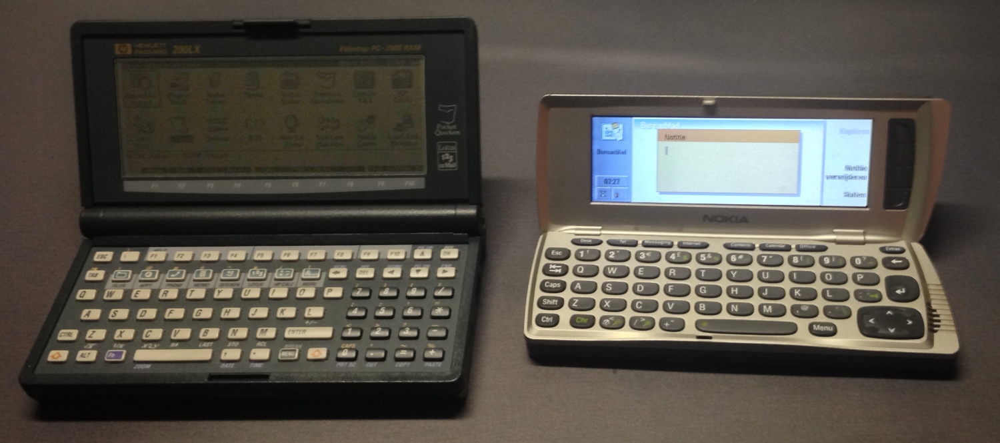
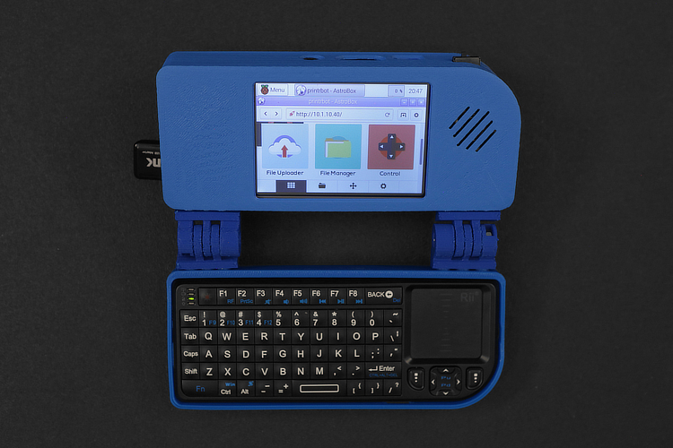
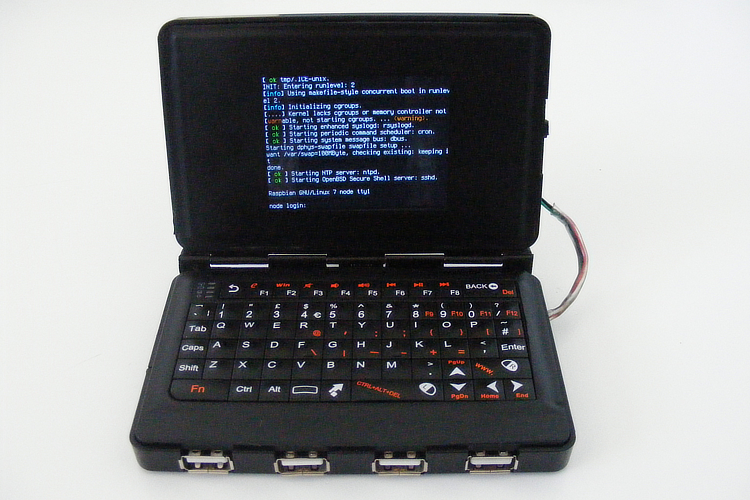

May 2016  
Originally published on [infi.nl](https://infi.nl/nieuws/hobbyproject-zelf-een-palmtop-bouwen/) (Dutch)

---
Ik ben altijd al gek geweest op palmtop/handheld computers, computers die je in een (flinke) binnenzak kan steken. Specifiek die met een toetsenbord in een clamshell, dus zeg maar een laptop op micro-formaat. De belangrijkste daarvan (voor mij) is de [Hewlett Packard 200LX](https://en.wikipedia.org/wiki/HP_200LX), maar ik heb bijvoorbeeld ook een [Nokia Communicator](https://en.wikipedia.org/wiki/Nokia_9210_Communicator) en de aller-, allereerste palmtop: de [Atari Portfolio](https://en.wikipedia.org/wiki/Atari_Portfolio) (niet de DIP-versie, helaas). Tegenwoordig kan je voor relatief weinig geld best kleine laptops kopen, maar in je binnenzak passen doen ze niet. De categorie handhelds is behoorlijk naar de obscuriteit verbannen dankzij de opkomst van de smartphone en de tablet. Nu vind ik die ook ontzettend cool, natuurlijk, maar er is iets in mij wat die clamshells van weleer mist.

## Pandora
Momenteel weet ik van slechts één device dat aan mijn ideaalbeeld voldoet: de [Pandora](https://pyra-handheld.com/boards/pages/pandora/). Het is echt een niche-device, ontwikkeld door hobbyisten voor hobbyisten. Of nou ja, op het moment niet helemaal: de Pandora is niet meer te koop en de opvolger, de Pyra, is nóg niet te koop. De Pyra gaat tussen de 600 euro en 750 euro kosten, afhankelijk van de uitvoering. Enerzijds valt de prijs behoorlijk mee: je krijgt een redelijk volwaardige computer (die in je binnenzak past!) met mobiel internet, wifi, GPS et cetera, maar anderzijds is het nog steeds best wel veel geld.

Een klein detail wat ik nog niet vermeld heb, is namenlijk dat ik deze devices niet echt ontzettend praktisch (meer) vind, want ook ik heb een smartphone die ik altijd bij me heb en die altijd ready-to-go in mijn broekzak zit. Uitgebreide verhalen typ ik daar niet op, maar hoewel zo'n handheld een hardware-toetsenbord heeft, zijn die dusdanig klein dat het nog steeds niet zo comfortabel typt als een normaal toetsenbord. Om dus even 600 euro neer te leggen voor een hebbeding… nou nee. Dan weet ik wel een beter doel voor mijn geld.

## Zélf een palmtop bouwen
Maar goed: ik zou dit verhaal niet gaan schrijven als ik er geen doel mee had. Ik heb namenlijk besloten zélf een palmtop te gaan bouwen. Tegenwoordig is het niet zo moeilijk om alle nodige onderdelen te vinden: zo kan je al beginnen met een Raspberry Pi als computer en zijn ook kleine beedschermpjes niet meer zo obscuur of duur als 15 jaar geleden. Het maken van een behuizing is ook niet meer zo ingewikkeld, want die kan je 3D printen (of misschien zelfs uit aluminium laten frezen – mooier, maar minder budgetvriendelijk). Ik ben ook niet echt de eerste met dat idee, (zie bijvoorbeeld [Adafruit](https://learn.adafruit.com/mini-raspberry-pi-handheld-notebook-palmtop/overview) en [Node](http://n-o-d-e.net/post/141489192021/how-to-create-a-handheld-linux-terminal-v2)) dus het moet sowieso haalbaar zijn. Alles bij elkaar is het nog wel ambitieus, want er zitten veel nieuwe dingen in voor mij. In komende periode zullen we erachter komen of ik het ook in me heb…

