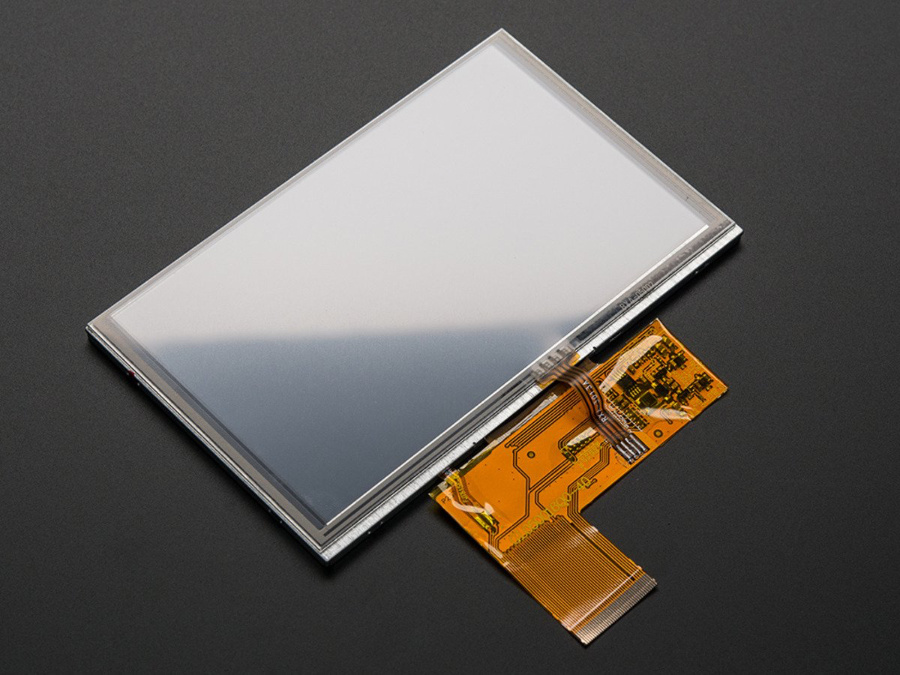
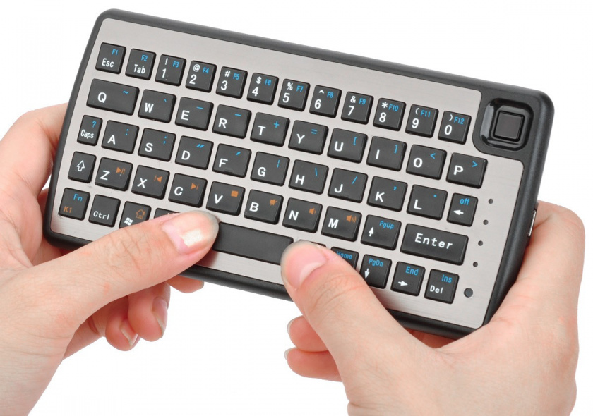
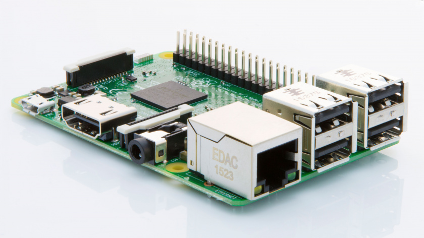
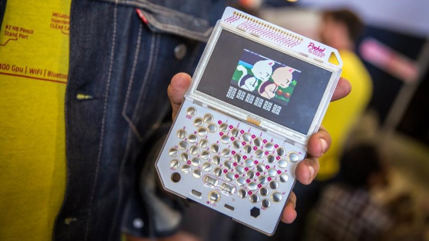

August 2016  
Originally published on [infi.nl](https://infi.nl/nieuws/hobbyproject-zelf-een-palmtop-bouwen-deel-2/) (Dutch)

---
Alweer twee maanden geleden heb je kunnen lezen over mijn voornemen om zelf een palmtop te gaan bouwen, dus je bent vast benieuwd hoe het daar nu mee staat. Tijd voor een update!

## Zoektocht naar het juiste beeldscherm
Toen ik aan dit project begon dacht ik dat het vinden van een geschikt beeldscherm het grootste probleem zou zijn. Ik wilde immers een klein beeldscherm (maar niet té klein), en ook nog een beetje een fatsoenlijke resolutie. Het mooist zou ik een echt "palmtop-scherm" vinden, wat voor mij betekent dat de beeldverhouding zo'n beetje 3:1 is (de modellen die mij interesseren hebben een resolutie van 640x200 of 640x240).

De enige manier om daar aan te komen is eigenlijk alleen door een schermpje roven van een oude en hopelijk kapotte palmtop of ik moet heel specialistisch gaan zoeken bij leveranciers in China. Als je dan iets vindt wat betaalbaar is, moet je nog een manier vinden om het aan te sluiten op de overige hardware. Dat zijn allemaal geen problemen die nog niet eerder zijn opgelost natuurlijk, maar voor mij als amateur die hooguit een simpel schakelingetje in elkaar kan solderen is dat allemaal wat hoog gegrepen. Ik had me er dus al vrij snel bij neergelegd dat dat hem niet zou gaan worden.

Gelukkig is het geen 1995 meer en zijn we met zijn allen groot fan geworden van breedbeeldschermen. Over het algemeen komen die niet in de buurt van de bovengenoemde 3:1-verhouding (21:9 komt in de buurt, maar die heb ik niet in pakweg 5 à 6" kunnen vinden), maar ik heb besloten dat ik 16:9/16:10 ook wel oké vind om mijn leven niet al te gecompliceerd te maken.

Toen ik die knoop had doorgehakt werd het allemaal wat makkelijker. Schermen met die beeldverhouding zijn er te kust en te keur. Daarmee zijn ze nog niet aangesloten op een Raspberry Pi (mijn initiële platformkeuze), maar ook daar geldt: het is gelukkig geen 1995 meer en het internet biedt een overvloed aan informatie.

Veel schermen die ik vond zijn middels HDMI aan te sluiten. Dat is natuurlijk erg gemakkelijk, ware het niet dat ik alles in kleine behuizing wil proppen. Alleen de stekkers zijn dan al een probleem, laat staan de extra kabellengte die komt met standaardkabels. Een andere optie is composite, maar dan ben je toch wel aan een vrij lage resolutie gebonden als je een scherp beeld wil. Dit project mag dan wel weinig praktisch nut hebben, maar ik wil nog wel die illusie een beetje hebben.

Gelukkig was ik nog niet zo lang aan het zoeken en toen kwam ik [deze tutorial](http://blog.reasonablycorrect.com/raw-dpi-raspberry-pi/) tegen. Daar hangt een vrij goedkoop (van $30 voor 5" zonder touchscreen tot $47.50 voor 7" met touchscreen, plus $10 voor een aansluitbordje) middels een paralelle interface aan een Raspberry Pi. De resolutie is 800x480, niet bepaald HD maar ik doe het ervoor. Dezelfde techniek zou ook moeten werken voor schermpjes met een hogere resolutie maar die zijn duurder en er kan al genoeg misgaan dus dit vind ik wel een prima keuze voor versie 1.0.

De grootte van het scherm is een praktische keuze. 7 Inch is wat groter natuurlijk, maar de hoogte wordt al snel problematisch: het scherm is 15,1cm breed en 9,4cm hoog. Ik verwacht dat ik al snel een rand rond het scherm ga hebben van een centimeter, en er moet ook nog een scharnier bij voor het openklappen. Met de middelen en kennis die ik heb is dat vast ook minimaal anderhalve centimeter, dus kijk je naar pak hem beet een apparaat van 17x13cm. Ter vergelijking: een VHS-casette is 18,7x10,3cm. Niet bepaald binnenzakmateriaal! Met 5" kom ik uit op pakweg ~13x10cm om het scherm te laten passen.

## Toetsenbord(probleem)
Toen ik aan dit project begon dacht ik dat het vinden van een geschikt toetsenbord het kleinste probleem zou zijn. Er zijn immers toetsenborden te kust en te keur te koop, en in alle soorten en maten. Nou, spoiler: het toetsenbordprobleem is nog niet opgelost.

Er zijn inderdaad kleine toetsenborden te vinden, maar de toestenborden die klein genoeg zijn voor een palmtop (ik zoek naar iets met een breedte van maximaal zo'n 16cm) zijn eigenlijk allemaal draadloos. Dat is ook de oplossing waar de twee voorbeelden uit mijn [vorige post](./part-1.html) gebruik van maken, maar ik vind het zelf toch niet echt een elegante oplossing.

Na een hoop zoeken en vloeken heb ik me er maar bij neergelegd dat een klein usb-toetsenbord vinden niet gaat lukken. Wat ik nu wil gaan proberen is zo'n draadloos toetsenbordje te kopen, alle elektronica eraf slopen en de matrix aansluiten op een [Teensy](https://www.pjrc.com/teensy/) en die als toetsenbordcontroller inzetten. Eventueel heb ik ook nog een reserve-toetsenbord van een HP 700LX palmtop (dat is hetzelfde toetsenbord als een HP 200LX, maar met andere kleuren), maar die gebruik ik liever niet.

## Systeembord opties
In eerste instantie had ik er voor gekozen om een Raspberry Pi 3 te gebruiken als systeembord. Hier is natuurlijk ontzettend veel over bekend, hij heeft bluetooth en wifi aan boord, 4 usb-poorten… Het is een mooi compleet pakket. Daarnaast is het een vrij krachtig bordje met een 1.2GHz 64 bit quad core processor en 1GB ram. Nadelig is dan weer dat hij vrij dik is vanwege alle connectoren die erop zitten. Die kan je er natuurlijk wel allemaal af halen, maar dat is wel een gedoe.

Een andere Raspberry Pi optie is de [Raspberry Pi Zero](https://www.raspberrypi.org/products/pi-zero/). Die is natuurlijk lang niet zo krachtig (maar ook wel weer goed genoeg) en heeft een kleinere footprint. Nadeel is dat ik daar voor alles extra hardware nodig heb: wifi en bluetooth zitten er niet standaard op, en ook voor de geluidsuitgang moet je nog een schakelingetje in elkaar zetten.

Voor beide Raspberry's geldt dat ook de stroomvoorziening een uitdaging is. Voor de 3 wordt maar liefst 2.5A geadviseerd, al kan je wel met minder toe, dus dat vereist wel het een en ander. Nu heeft Adafruit een handig bordje, de [PowerBoost](https://www.adafruit.com/products/2465), waarmee je een lipo-cell kan aansluiten en die ook kan opladen terwijl je het device gebruikt. Deze levert echter max 1A, wat te weinig is.

Uiteindelijk ben ik uitgekomen bij de [C.H.I.P.](https://getchip.com/). Deze kost $9 en is net iets krachtiger dan de Pi Zero. Daarnaast heeft hij wifi, bluetooth en audio aan boord… Én een laadcircuit voor een lipo-batterij dat maar liefst 2A kan leveren op 5V. Meer dan genoeg voor het systeembord, het scherm en een usb-poort. Daarnaast heeft hij 4GB flash-geheugen waar het systeem op draait en zijn de aansluitingen voor een parallel display en touchscreen al voorzien zodat dat als het goed is minder hacky is dan op de Raspberry Pi's. Het toetsenbord kan ik dan waarschijnlijk ook aanluiten op de GPIO-pinnen, zodat ik de Teensy kan schrappen. Ik heb zelf de [Pocket C.H.I.P.](https://getchip.com/pages/pocketchip) besteld wat een complete unit is: de C.H.I.P. zelf, een batterij, een schermpje, een (soort van) toetsenbord en een behuizing om alles bij elkaar te houden. Dat is eigenlijk bijna wat ik zelf wil maken, behalve de form factor en de lage resolutie van het scherm. Daar moet ik dus een hoop inspiratie uit op kunnen doen! De levering is helaas uitgesteld, dus de verzenddatum is nu half september. Het gaat dus nog even duren voordat ik echt verder kan.

## Volgende stap
Voor nu kan ik verder met het toetsenbord: een kleine kopen, en proberen aan te sluiten de Teensy. Ergens eind september kan ik mijn C.H.I.P. verwachten, en daar mee gaan spelen. Dan zal ik ook een beeldschermpje bestellen en proberen aan te sluiten op de C.H.I.P..

Mocht je je vervelen tot het zover is, dan is [Psioπ](https://hackaday.io/project/4042-psio) van RasmusB een heel interessant project om te volgen! Hij wil namelijk een oude Psion van nieuwe hardware wil voorzien. Redelijk hardcore, en ontzettend cool!