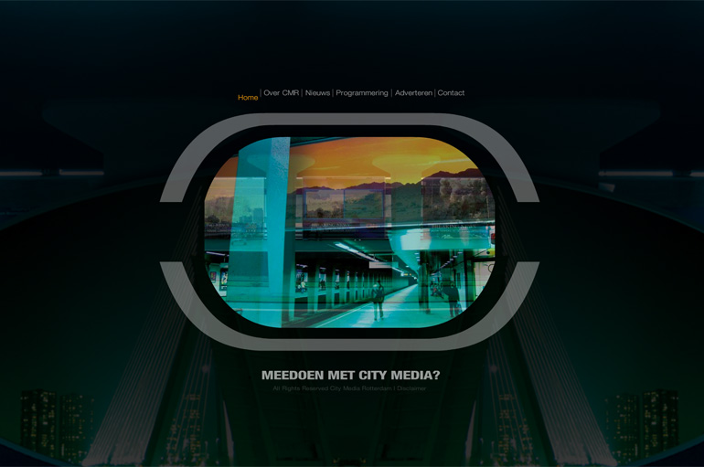
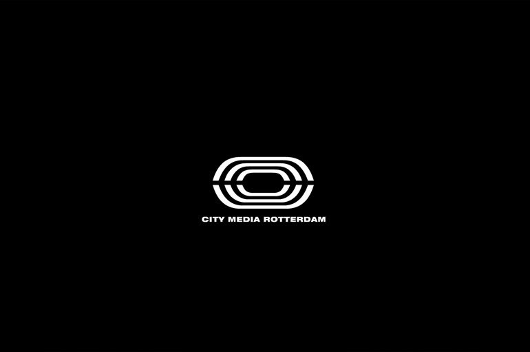
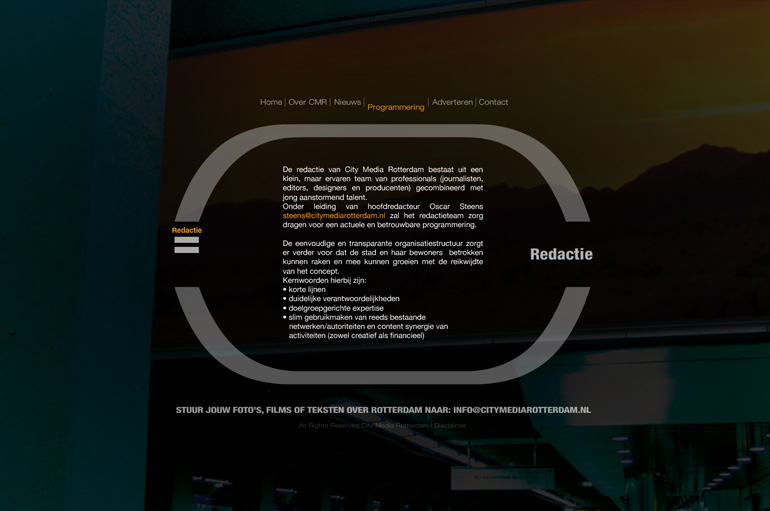

## City Media Rotterdam

Client: Inqubative  
What: Branding website  
Role: Technical direction, Programming (ActionScript 3)  
Credits: Catch Interactive  

City Media Rotterdam wants to become the virtual reflection of Rotterdam by placing video displays in the city. To attract and inform investors created a glossy branding website. The design and animations are based on the City Media Rotterdam logo.
