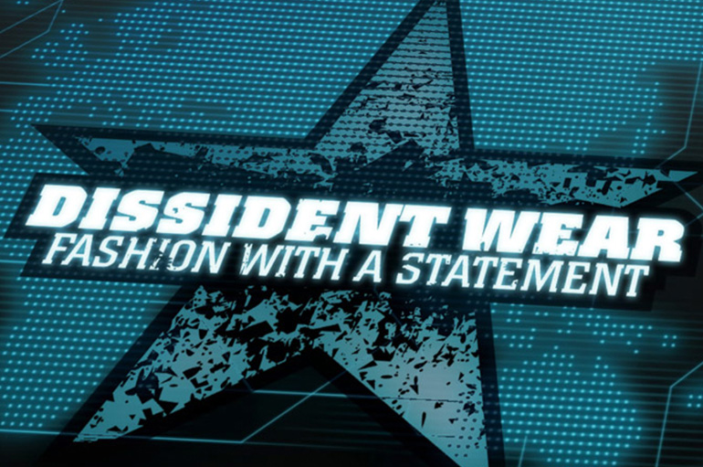
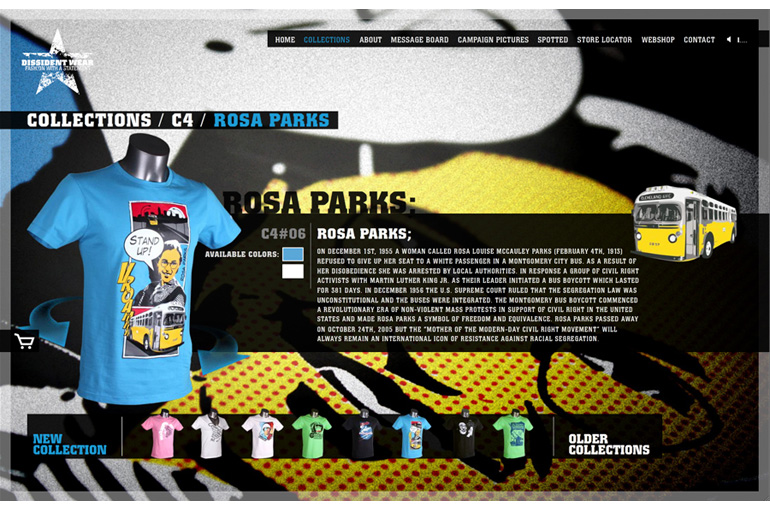
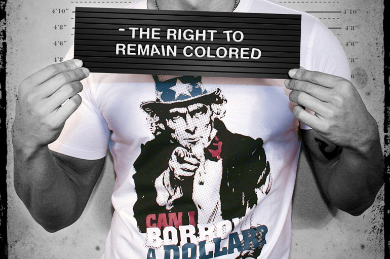

## Dissident-wear

Client: Dissident-wear  
What: Branding website  
Role: Concept design, Technical direction, Programming (ActionScript 3, PHP), CMS implementation  
Credits: Catch Interactive  
Awards: [Dope Award](http://www.dopeawards.com/?winner=1952), nominated for [Pixel Awards](http://www.pixelawards.com/nom_win_2010.php#Fashion)   

Dissident-wear is an ode to people with remarkable achievements. By creating striking prints, the label focuses in on the various forms of pain and suffering still inflicted to both our planet and its habitants in modern day life. For their internet presence, we developed a bold websites which is an interactive showcase of all the collections that Dissident-wear offers, representing their style and attitude.
