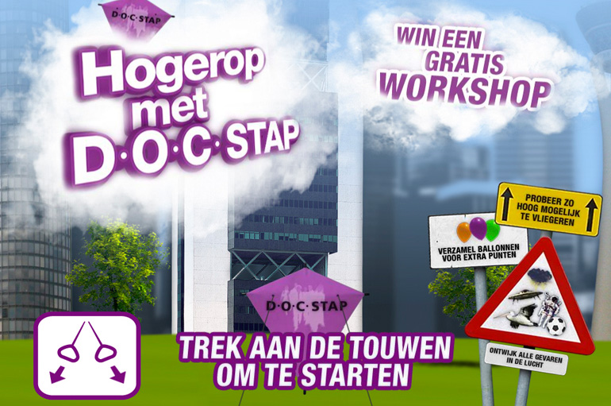
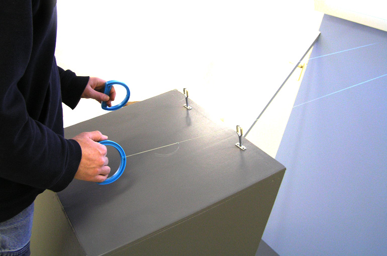
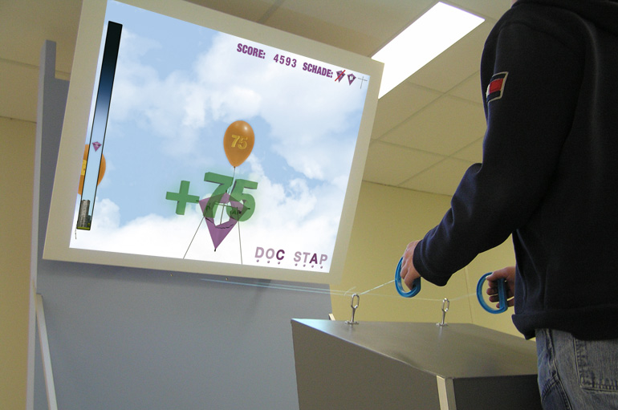
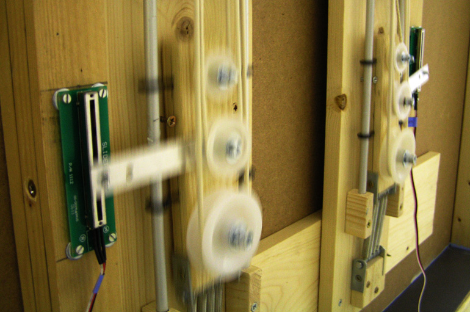

## Kite-flying game

Client: DOC Stap  
What: Trade fair installation  
Role: Concept design, Technical direction, Programming (ActionScript 3, C), Electronics  
Credits: Catch Interactive  

To attract visitors to the stand of DOC Stap, an educational institution, we developed a game using which one (almost) literally has to get higher up. By pulling the ropes the players had to manoeuvre their virtual kite trough a sky filled with obstacles such as birds, thunderclouds and UFOs in order to fly as high as they could.
