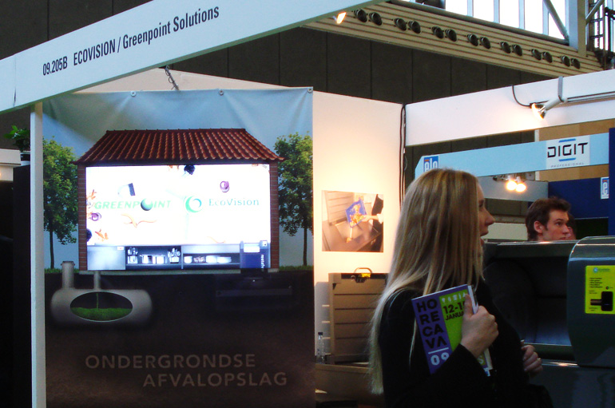

## Eyecatcher

Client: EcoVision &amp; Greenpoint Solutions  
What: Trade fair installation  
Role: Concept design, Technical direction, Programming (ActionScript 3)  
Credits: Catch Interactive  

EcoVision and Greenpoint Solutions asked for an eyecatcher to promote their Ecopers and Swill Tank. Using the life-size canvas print and interactive display which reacts to passers-by we caught the visitors&rsquo; attention to these solutions for underground waste storage.
