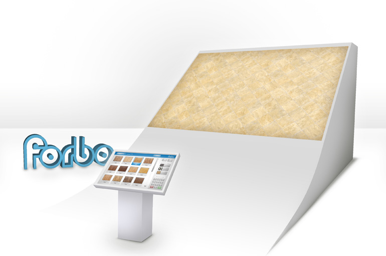
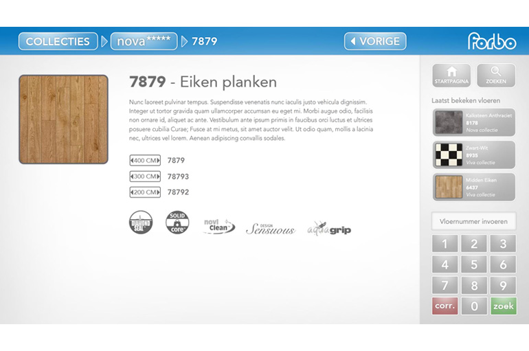
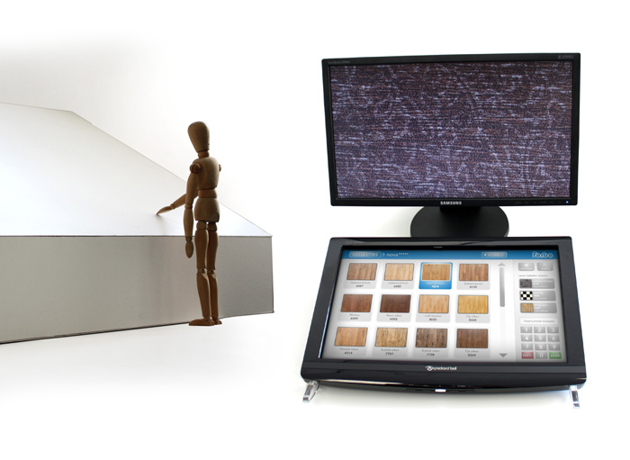

## Interactive floor

Client: Forbo Flooring  
What: Concept design and prototype  
Role: Concept design, Technical direction, Prototype programming, Research  
Credits: Catch Interactive  

Due to the large collection of available dessins, Forbo Flooring cannot all show them life-size. We developed an interactive floor which uses projection to show the dessins at about 4 by 3 metres in size.
