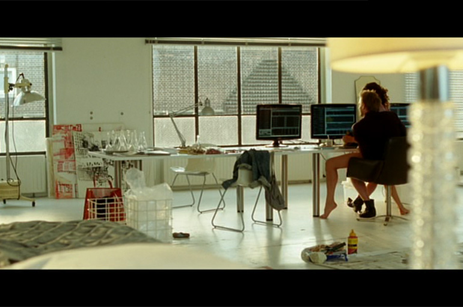
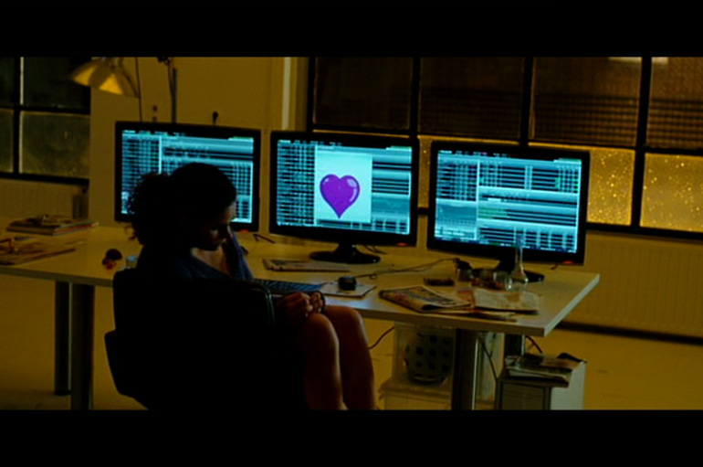
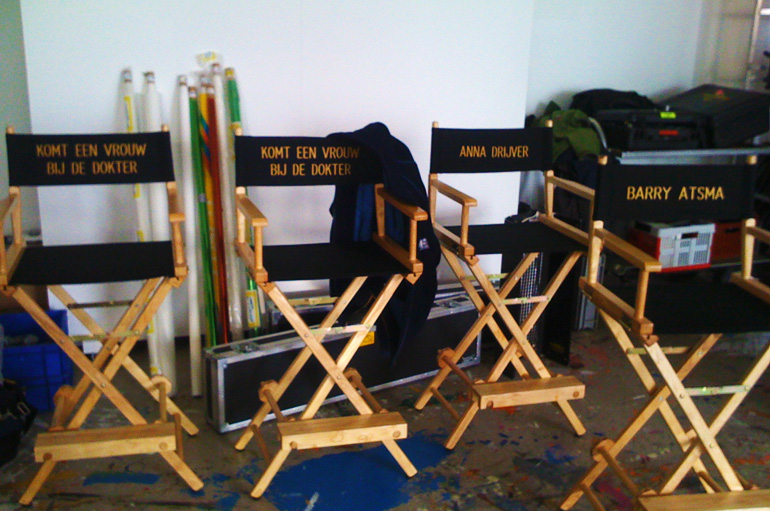
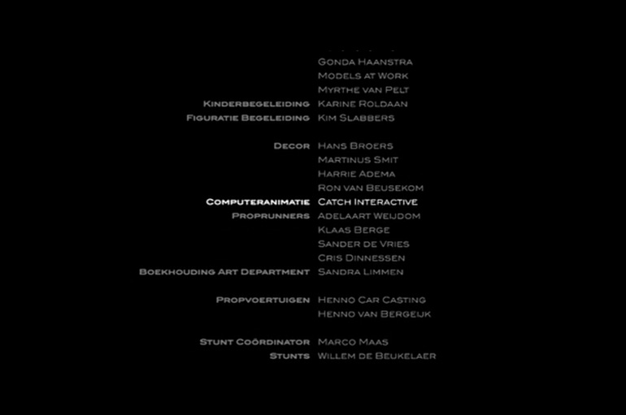

## Komt een vrouw bij de dokter

Client: Rozenstraat Film  
What: Remote controlled computer animations  
Role: Project Management, Programming (ActionScript 3)  
Credits: Catch Interactive  

For the film 'Komt een vrouw bij de dokter' (Stricken) by Reinout Oerlemans we were asked to  create several computer animations simulating computer interactions. Some were remotely triggered to show up on cue.
