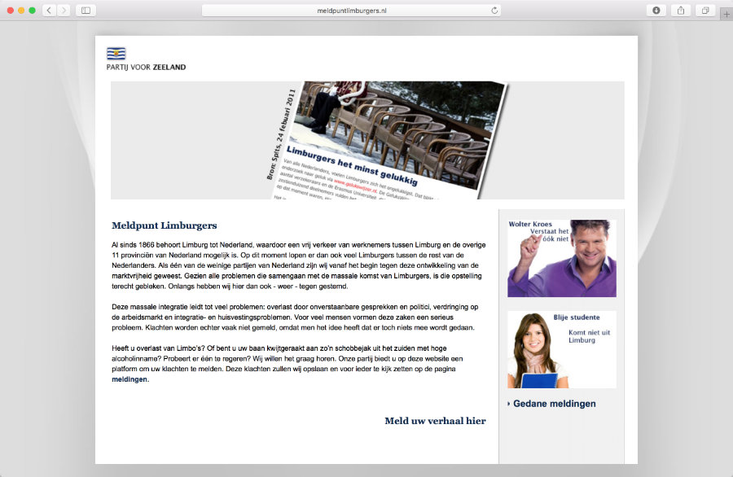
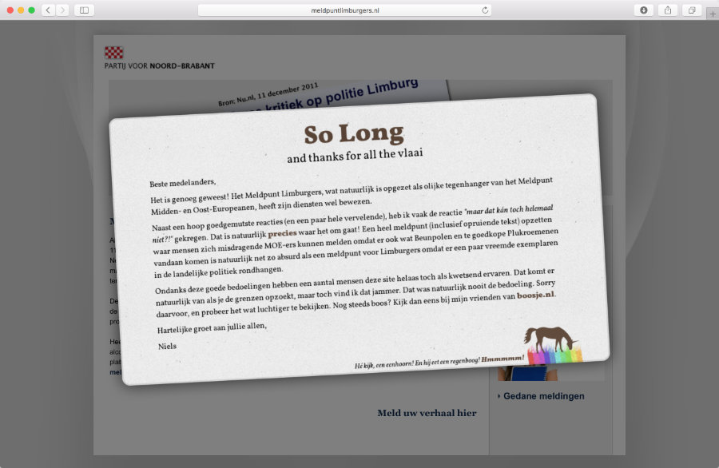

## Meldpunt Limburgers

Client: Personal project  
What: Satirical website  
Role: Getting shouted at a lot  

In 2012, the Partij voor Vrijheid (Freedom Party), a right-wing populist political party in the Netherlands launched a website were people could report nuisances caused by middle- and eastern Europeans. I found this highly objectionable and whipped up a quick site (by ripping of theirs) where one could report nuisances committed by people from Limburg (the province where Geert Wilders, the founder of the PVV, is from), which is of course just as ridiculous. It received a lot of attention and reached the national news, not in the least because a lot of people were of the opinion that you just couldn't single people out just because they were from Limburg (thanks for making my point). Because the reports posted by users were shown publicly on the website, and this being the internet, I had to shut it down rather quickly but I was glad I could get my point across.
