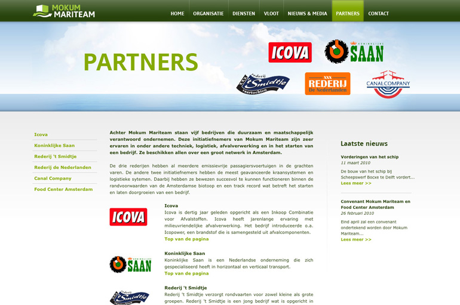

## Mokum Mariteam

Client: Mokum Mariteam  
What: Branding and informational website  
Role: Technical direction, Implementation in our CMS, Programming (PHP, ActionScript 3.0)  
Credits: Catch Interactive  

We've created this website for Mokum Mariteam. It promotes their new project to transport cargo through the Amsterdam canals in a eco friendly way. We've both designed and built the website. Next to that we also did the complete corporate identity.

Link: [website](http://mokummariteam.nl)
